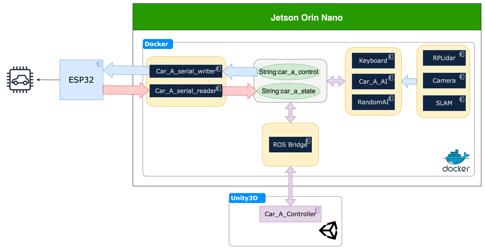

# PROS-Car

Authors:

- 陳麒麟
- 曾裕翔
- 林庭琮
- 鍾博丞

Advising professor:

- 蘇文鈺


## Car Type

| Type | Description                                                |
| ---- | ---------------------------------------------------------- |
| A    | Rear-wheel drive, front-wheel steering                     |
| B    | Rear-wheel drive                                           |
| C    | Four-wheel drive <font color=#0000FF>with robot arm</font> |
| D    | Mecanum wheel                                              |


## Workflow Diagram



## Deprecated Warning

The image in this repository `pros_car` is deprecated. Use `pros_ai_image` instead.


## Feature

The docker image in this project has the following 4 features shown above.

- `Keyboard`
- `Car_<A,B,C,D>_serial_reader`
- `Car_<A,B,C,D>_serial_writer`
- `RandomAI`
- `arm_reader`
- `arm_writer`
- `cv_bridge`: Convert the compressed ROS image to OpenCV image format.


## The Link to the other Features

[pros_app](https://github.com/otischung/pros_app) contains the following features.

- `RPLidar`
- `Camera`
- `SLAM`

[pros_AI](https://github.com/otischung/pros_AI) contains `Car_B_AI`.

[pros_AI_image](https://github.com/otischung/pros_AI_image) contains the docker image used by pros_AI.


# Get Started

## Docker

### GitHub Repository

You can clone it by using HTTPS

```bash
git clone https://github.com/otischung/pros_car
```


### Add User to Docker Group

You must add the user to the docker group to get permission for docker.

```bash
usermod -a -G docker <username>
```


### Pull Image

You can pull the docker image by the following command. This image is automatically built by GitHub Actions CI and it contains two versions of OS type, including amd64 and arm64.

```bash
 docker pull ghcr.io/otischung/pros_ai_image:latest
```


### Run Image

After building the image, execute the following command to run the image to become the desired container.

```bash
docker run -it --rm -v "$(pwd)/src:/workspaces/src" --network pros_app_my_bridge_network --device=/dev/usb_front_wheel --device=/dev/usb_rear_wheel --device=/dev/usb_robot_arm  --env-file ./.env ghcr.io/otischung/pros_ai_image:latest /bin/bash
```

- `-i`: The container will get `stdin` from your keyboard.
- `-t`: The container screen will show on your display monitor.
- `--rm`: The container will be shut down automatically when detaching.
- `-v "<host/location:/container/location>"`: Mount the host location into container.
- `--network <network_name>`: Use the network you provided. We use bridge netowrk here. You can see all docker netowrk with `docker network ls`.
- `--env-file`: This will pass the environment variables defined in the specific file to the container.
- In the end, tell the container what program should be executed. We use `bash` in this case.


### Use the Shell Script to Run the Image

We've written 2 shell scripts to run the image.

> car_control_2.sh
>
> car_control_4.sh


### A Quick Solution for Developing Containers

VSCode has these extensions, which are `docker` and `dev containers`.

After that, you can build your image from `Dockerfile` by launching `dev containers`.

- Press `ctrl+shift+p`, then select `Dev Containers: Rebuild and Reopen`.


## Environment Variables

These environment variables are defined in `.env`.

### ROS Domain ID

You may change the ID number to divide other ROS environments.

```bash
export ROS_DOMAIN_ID=1
```


### Setting for the Speed of the Car

You can change the speed of your car via the Linux environment variable `WHEEL_SPEED` using the unit rad/s.

```bash
export WHEEL_SPEED=3
```


## ROS2 Services

### The Password of Cars

`digitaltwin`


### Code

- `Dockerfile`
  - You may change the ID number to divide other ROS environments.

```python
ENV ROS_DOMAIN_ID=1
```

- `Car<A~D>_serial_writer.py`
  - Send the signals to jetson orin nano, receive the signals from `Car<A~D>_keyboard.py`.
- `Car<A~D>_keyboard.py`
- Send the signal to `Car<A~D>_serial_writer.py`, in `target_vel`, index 0 is the left wheel, index 1 is the right wheel.
- if the car type is four-wheel drive, we have two lists, one contains `self._vel` and  `self._vel2` and the other contains `self._vel3` and `self._vel4`.

```python
# two wheels:
target_vel = [self._vel, self._vel]

# four wheels 
target_vel = [self._vel, self._vel2] 
target_vel = [self._vel3, self._vel4] 
# These two target velocities are sent through different topics
```

- `env.py`

  - When we set the USB port, if we run `Car<A~D>_serial_writer.py` and the terminal shows that “cannot find the desired USB port”, then you have to edit this script or check out the USB port on the car device.
  - You can run `ls /dev/ttyUSB*` to check your USB port number. 
    (if there doesn’t appear any USB devices, you must exit docker, and check the USB port on the car, `ttyUSB<0~3>` number depends on the inserted order)
  - We've defined <font color=#FF0000>the name of the soft link</font> for `usb_front_wheel`, `usb_rear_wheel`, and `usb_lidar` in [pros_app](https://github.com/otischung/pros_app). You may also use these rules in this container.
  - [Referene](https://inegm.medium.com/persistent-names-for-usb-serial-devices-in-linux-dev-ttyusbx-dev-custom-name-fd49b5db9af1)

- `car_models.py`

  - For all received data-class types, which the behavior is like `struct` in `C/C++`.

- Open two terminals to run the car

  - We use `tmux` to open two terminals, press`ctrl+B` → `shift+5` will open two terminals vertically; and press `ctrl+B` → `shift+"` will open two terminals horizontally, using `ctrl+b` + arrow keys to change between terminals.

  ```python
  sudo apt install tmux
  ```

- run the car (open two terminals)

  - Use `w a s d` or other keys to control the car.
  - Press `z` to stop the car.
    - Note: The car will always go forward and then stop slowly in any case. This is a bug in the C++ program controlling the ESP32.
  - Press `q` to exit the `keyboard.py`.

  ```python
  ros2 run pros_car_py car<A~D>_serial_writer.py
  ```

  ```python
  ros2 run pros_car_py car<A~D>_keyboard.py
  ```


## GTK in Docker

If you want to show GUI in docker, you need to configure your host first.

```bash
xhost +
```

And then run your docker image by the following command:

```bash
docker run -it --rm -v "$(pwd)/src:/workspaces/src" --network pros_app_my_bridge_network  --env-file ./.env -v /tmp/.X11-unix:/tmp/.X11-unix -e DISPLAY=$DISPLAY ghcr.io/otischung/pros_ai_image:latest /bin/bash
```

